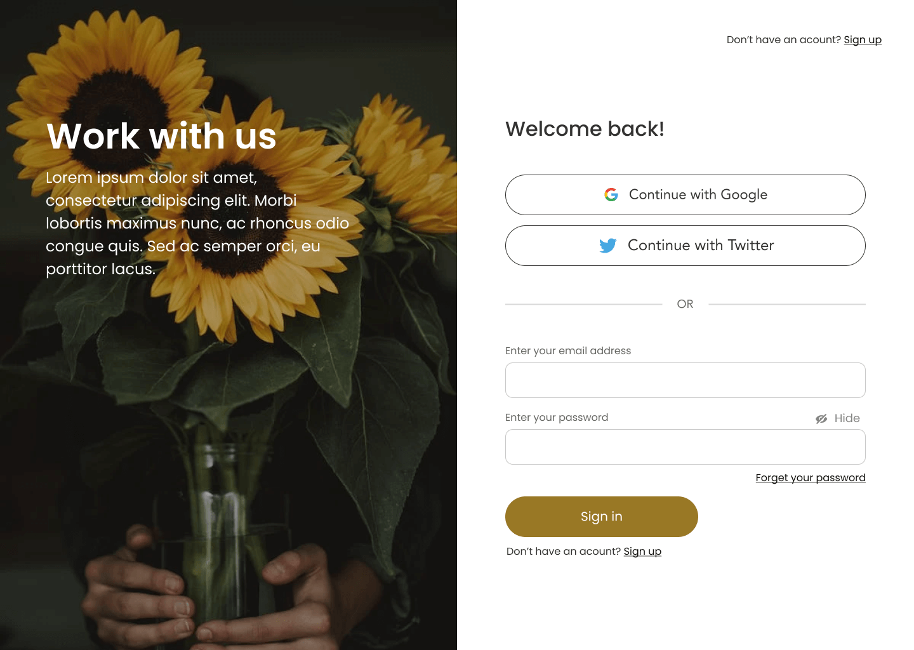

# intern2Grow-ui-developer-login-page

### Login UI Implementation

#### Overview

This repository contains the implementation of a login UI based on a design provided via a Figma link. The purpose of this project is to replicate the design as closely as possible using HTML and CSS, ensuring a responsive and user-friendly interface.

[View Demo](https://billalben.github.io/intern2Grow-ui-developer-login-page/)

[Link Figma](https://www.figma.com/design/B9rTBq4yUxdTie9CS0hi6e/Intern2Grow---UI-Developer---Login-Page?node-id=1-147&t=eXj0ip2IFZgey20e-1)

